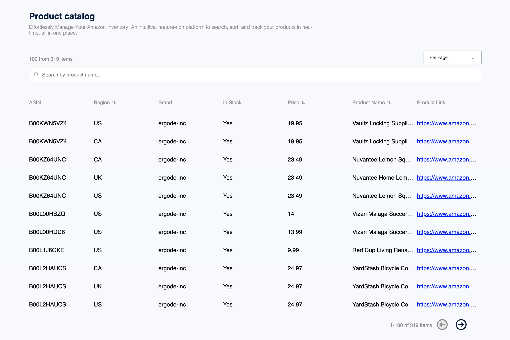
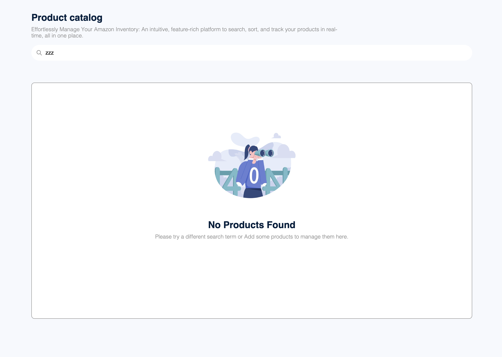

# Product Catalog

This app allow you to view and manage your product catalog including search, sorting, pagination and much more.

- Note that the server may enter sleep so it will require a reload upon entering

## Live Demo

https://product-catalog-lior.netlify.app

## Screenshot

## Installation and Usage

1. Clone the repository to your local machine using the command
   `git clone https://github.com/liordesta/product-catalog.git`.
2. Navigate to the project directory using `cd product-catalog`.
3. Install frontend dependencies using `cd frontend && npm install or yarn install`.
4. Install backend dependencies using `cd backend && npm install or yarn install`.
5. Create a new Mongo cluster and a new collection named `products`.
6. Create a local `.env` file on the _backend_ root and add `MONGODB_URI=<CONNECTION_STRING>`.
7. Run `node insertData.js` file on the _backend_ root to populate the DB.
8. Create a local `.env` file on the _frontend_ root and add `REACT_APP_API_URL_LOCAL=http://localhost:3001/api`.
9. Start the development on both `backend` & `frontend` using `npm start or yarn start`.

## Technologies

List of technologies/tools used in the project:

- ReactJS
- NodeJS
- Express
- MongoDB
- React Query
- Typescript
